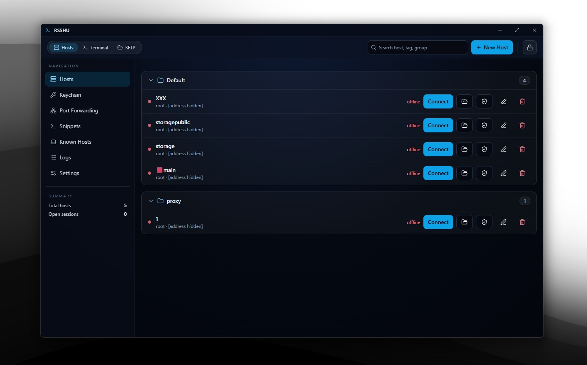

<div align="center">


# RSSHU

### A free, cross-platform SSH & SFTP desktop client — with encrypted vault and cloud sync

<br/>



<br/><br/>

</div>

---

## Overview

**RSSHU** is a lightweight, native desktop SSH & SFTP client built with [Tauri 2](https://tauri.app), React, and Rust. It solves the common developer pain point of managing multiple remote servers — juggling credentials, remembering hostnames, and syncing settings across machines — by providing a polished, privacy-first interface with an **encrypted local vault** and optional **GitHub Gist sync**.

No subscriptions. No telemetry. Runs on Linux and Windows. Your credentials stay yours.

---

## ✨ Features

- 🔐 **Encrypted Credential Vault** — All host credentials are saved locally and encrypted. Nothing leaves your machine without your consent.
- ☁️ **GitHub Gist Sync** — Sync your encrypted vault across machines using a private GitHub Gist. Free, no account required beyond GitHub.
- 🖥️ **Integrated Terminal** — Open a full SSH terminal session without leaving the app.
- 📂 **SFTP File Browser** — Browse, upload, and download remote files through a clean file-manager interface.
- 📊 **System Status Bar** — Optional live display of CPU, RAM, and network usage during active sessions.
- 🪶 **Native & Lightweight** — Ships as a small native binary. Fast to start, light on resources.
- 🔄 **Multi-Host Management** — Organize and quickly switch between all your remote servers from one place.

---

## 🖼️ Demo / Preview

> A full SSH session with integrated terminal and SFTP file browser.

<div align="center">

</div>

---

## 🛠️ Tech Stack

| Layer | Technology |
|---|---|
| **UI Framework** | [React](https://react.dev) + [TypeScript](https://www.typescriptlang.org) |
| **Build Tool** | [Vite](https://vitejs.dev) |
| **Styling** | [Tailwind CSS](https://tailwindcss.com) |
| **Terminal** | [xterm.js](https://xtermjs.org) |
| **Desktop Runtime** | [Tauri 2](https://tauri.app) |
| **Backend Language** | [Rust](https://www.rust-lang.org) |
| **SSH / SFTP** | [ssh2](https://crates.io/crates/ssh2) (libssh2 bindings) |
| **Encryption** | Argon2 (key derivation) + AES-GCM |
| **Cloud Sync** | GitHub Gist API (optional) |

---

## 🚀 Installation

### Prerequisites

Make sure you have the following installed before building from source:

- **[Node.js](https://nodejs.org/)** (LTS version recommended)
- **[Rust](https://www.rust-lang.org/tools/install)** (stable toolchain)
- **Tauri system dependencies** for your OS → [see the official guide](https://v2.tauri.app/start/prerequisites/)

### Download a Release

The fastest way to get started — grab a pre-built installer from the [Releases page](https://github.com/hdmain/rsshu/releases):

```
Linux   → .AppImage / .deb
Windows → .msi / .exe
```

### Build from Source

```bash
# 1. Clone the repository
git clone https://github.com/hdmain/rsshu.git
cd rsshu

# 2. Install frontend dependencies
npm install

# 3. Run in development mode
npm run tauri -- dev

# 4. Build a production installer
npm run tauri -- build
```

> Built artifacts are placed in `src-tauri/target/release/bundle/`

---

## 💡 Usage

### Connecting to a Host

1. Launch RSSHU and open the **Hosts** panel.
2. Click **Add Host** and fill in your hostname, port, username, and authentication method (password or SSH key).
3. Credentials are saved to the encrypted local vault automatically.
4. Click **Connect** — your terminal session opens instantly.

### SFTP File Transfer

```bash
# Once connected via SSH, switch to the SFTP tab
# Drag-and-drop files, or use the upload/download buttons
# All transfers are handled over the same authenticated connection
```

### Enabling GitHub Gist Sync

```bash
# In Settings → Sync:
# 1. Generate a GitHub Personal Access Token with 'gist' scope
# 2. Paste it into the Sync settings panel
# 3. RSSHU will create a private encrypted Gist for your vault
# 4. On any other machine, enter the same token to restore your hosts
```

---

## 📁 Project Structure

```
rsshu/
├── src/                   # React UI
│   ├── components/        # Hosts, Terminal, SFTP, Settings panels
│   ├── hooks/             # Custom React hooks
│   └── types/             # TypeScript type definitions
│
├── src-tauri/             # Rust backend
│   ├── src/               # Core logic: SSH, SFTP, vault, Gist sync
│   ├── icons/             # App icons
│   └── tauri.conf.json    # Tauri configuration
│
├── public/                # Static assets
├── index.html             # App entry point
├── vite.config.ts         # Vite configuration
├── tailwind.config.js     # Tailwind configuration
└── package.json
```

---

## 🗺️ Roadmap

- [x] SSH terminal integration (xterm.js)
- [x] SFTP file browser
- [x] Encrypted local credential vault (Argon2 + AES-GCM)
- [x] GitHub Gist sync
- [x] System status bar (CPU, RAM, network)
- [x] Linux & Windows support
- [ ] macOS support
- [ ] SSH key generation & management UI
- [ ] Port forwarding / tunneling support
- [ ] Multiple simultaneous terminal tabs
- [ ] Dark / light theme switcher
- [ ] Jump host (bastion) support
- [ ] Auto-reconnect on dropped sessions

---

## 🤝 Contributing

Contributions are warmly welcome! Whether it's a bug fix, a new feature, or a documentation improvement — every bit helps.

1. **Fork** the repository
2. **Create** a feature branch: `git checkout -b feat/my-feature`
3. **Commit** your changes: `git commit -m 'feat: add my feature'`
4. **Push** to your branch: `git push origin feat/my-feature`
5. **Open a Pull Request** and describe what you've changed

Please keep PRs focused and include a clear description of the problem being solved. For large changes, consider opening an issue first to discuss the approach.

---

## 📄 License

This project is licensed under the **MIT License** — see the [LICENSE](./LICENSE) file for details.

You're free to use, modify, and distribute RSSHU for personal or commercial purposes.

---

## 👤 Author

**hdmain**

- GitHub: [@hdmain](https://github.com/hdmain)
- Repository: [github.com/hdmain/rsshu](https://github.com/hdmain/rsshu)

---

<div align="center">

Made with ❤️ using Tauri, Rust, and React

⭐ If you find RSSHU useful, consider starring the repo — it really helps!

<br/>

[](https://github.com/hdmain/rsshu/actions)
[](https://github.com/hdmain/rsshu/releases)
[](./LICENSE)
[](https://tauri.app)
[](https://www.rust-lang.org)
[](https://www.typescriptlang.org)
[](https://github.com/hdmain/rsshu/releases)

</div>